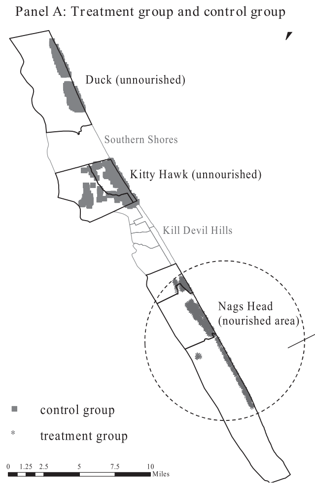

```{r setup, include=FALSE}

knitr::opts_chunk$set(echo = FALSE)

library(tidyverse)
library(rstan)
library(knitr)
library(readxl)
library(stargazer)
df <- read_excel("Dare_geocoded.xls")


```

# Background and Overview 

This project replicates the difference-in-differences model estimated in Qiu and Gopalakrishnan's 2018 paper, "Shoreline defense against climate change and capitalized impact of beach nourishment" using a Bayesian framework [(link to paper)](http://dx.doi.org/10.1016/j.jeem.2018.08.013). The paper evaluates the impact of beach nourishment (which is "the process of replacing an eroding section of a beach with sand dredged from inlets or offshore sand reserves") on coastal housing prices. The analysis focuses on on island in the Outer Banks of North Carolina. Here is the map of the area analyzed for reference:

```{r, out.width = "32%", fig.align="center"}
 
```

In the analysis, the authors compare the trend in sale prices of homes in Nags Head (the town that received beach nourishment) to the trend of sale prices in Duck and Kitty Hawk (which are towns that didn't receive beach nourishment until a few years after Nags Head). Here, receiving the beach nourishment is considered the treatment. The authors' diff-in-diff model takes the form:

$$ ln(P_{ijt}) = \alpha_0 + \alpha_1X_i + \beta_1Nourish + \beta_2Nourish*PostNourish + \eta_j + \zeta_t + \epsilon_{ijt}   $$
where $P_{ijt}$ is the price of home $i$ in location $j$ sold in year $t$. $X_i$ is a vector of control variables for housing characteristics. $Nourish$ is an indicator variable for being in the treatment group. The main coefficient of interest is $\beta_2$, which is the average treatment effect of beach nourishment. The authors also include town and year fixed effects ($\eta_j$ and $\zeta_t$ respectively). 

# OLS Estimation Results

In the published paper, the authors use a matching algorithm to match houses in the treatment group to comparable houses in the control group. I do not have access to the matching code or matched data set. For the puposes of this paper, I estimate the model across all observations. 

```{r}

df1 = df %>%
  mutate(Nourish = ifelse(city == "NAGS HEAD", 1, 0)) %>%
  mutate(PostNourish = ifelse(sale_year > 2010, 1, 0)) %>%
  mutate(age = sale_year - year_built) %>%
  mutate(sale_year = as.factor(sale_year)) 
  

```

```{r}

model1 = lm(log(price) ~ bathroom + sqft + I(sqft^2) + age + stry + I(dist_Shoreline_m / 10) + OceanFront + Nourish + PostNourish + Nourish*PostNourish + city + sale_year, data = df1)

```

```{r, results='asis'}

stargazer(model1, header = FALSE,
          title = "OLS Regression Results",
          add.lines = list(c("Town Fixed Effects?", "Yes"), c("Year Fixed Effects?", "Yes")),
          omit = c("sale", "city"),
          dep.var.labels = "ln(Sale Price)",
          covariate.labels = c(
            "\\# of Bathrooms",
            "Living Area (100 Sqft)",
            "Living Area Squared",
            "Age of Property (Years)",
            "\\# of Stories",
            "Distance to Shoreline (10m)",
            "Ocean Front = Yes",
            "Nourish",
            "PostNourish",
            "Nourish*PostNourish"
          )
          )

```